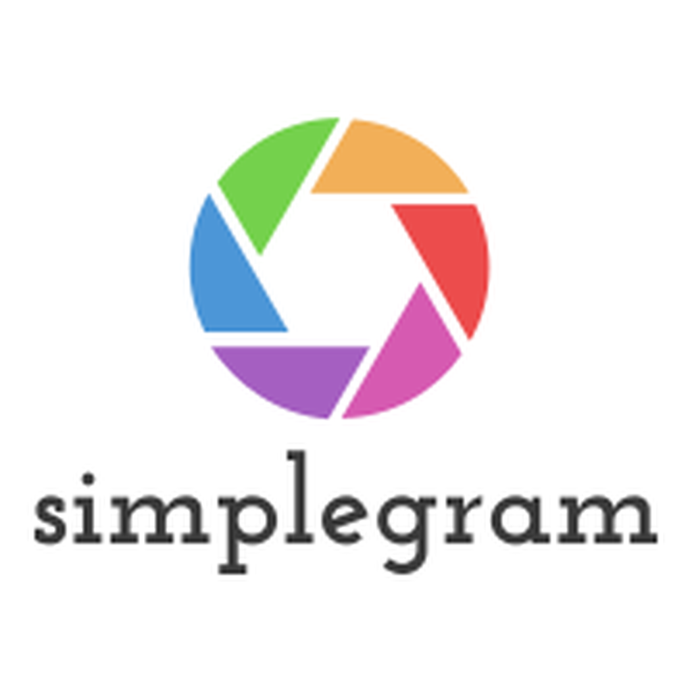

# iOS app: simplegram
My side project : A SNS iOS app. More details coming soon 

<h3 align="center">

</h3>

## Getting Started

download simplegram.zip (ignore other files under this repo) -> open it -> open simplegram.xcodeproj with Xcode

## Compatibility

This project is written in Swift 5/ SwiftUI 2.0 (with using lazygrid). The newest version  of kinfisher needs Xcode 12 to import, so it requires Xcode 12 or newer to build and run.( using xcode 11 will cause compile error )

## Author

* Zhousenye Liu

